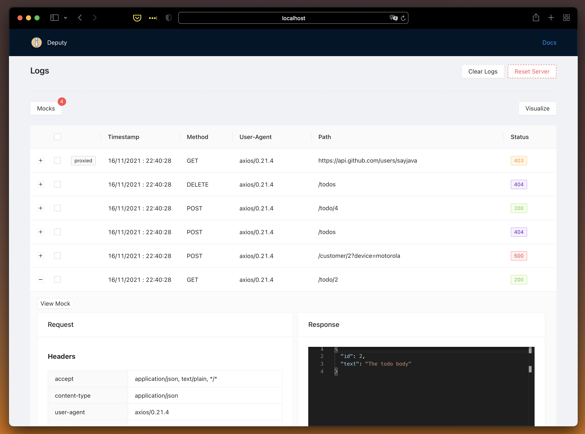
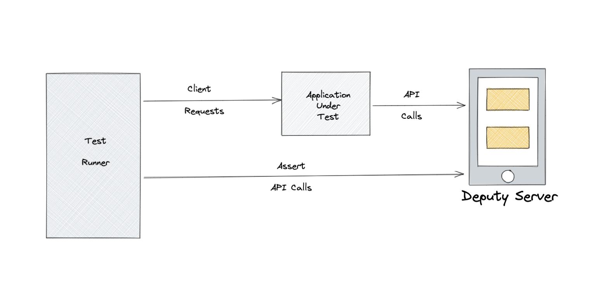

 <h1 align="center">Deputy</h1>
 <p align="center">
  
 </p>
 <p align="center">
The easiest and quickest way to mock HTTP endpoints for development and testing purposes
 </p>
 <p align="center">
    <a href="https://sayjava.github.io/deputy/"><strong>Explore deputy docs »</strong></a>
 </p>
 <p align="center">
  <a href="https://sayjava.github.io/deputy/start">Quick Start »</a>
  <a href="https://sayjava.github.io/deputy/guide">Guide »</a>
  <a href="https://sayjava.github.io/deputy/api">API »</a>
 </p>
 <p align="center">
  
  
  
 </p>

# What is Deputy?

Deputy is an HTTP API mocking server that can aid in rapid application development by mocking endpoints and configuring responses from configurations.

Deputy can also act as a testing server to validate what requests made by system under test.



Here is a sample mock definition

```json
[
    {
        "request": {
            "path": "/user/(\\d+)/slug/(.*)",
            "params": {
                "output_type": "json|xml"
            }
        },
        "response": {
            "status": 200,
            "headers": {
                "Content-Type": "application/json"
            },
            "body": [
                {
                    "id": "slug-id",
                    "content": "The post content"
                }
            ]
        }
    }
]
```

## Quick Start

With nodejs

```shell
npx @sayjava/deputy
```

With docker

```shell
docker run -p 8080:8080 -p 8081:8081 ghcr.io/sayjava/deputy
```

and test a sample endpoint

```shell
curl http://localhost:8080/who-am-i
```

## Features

-   [Declarative request matching and response](https://sayjava.github.io/deputy/guide)
-   [Regex based request matching](https://sayjava.github.io/deputy/guide) (request path, headers and body matchers)
-   [Alternate and limit responses on same request](https://sayjava.github.io/deputy/guide)
-   [HTTP request validations](https://sayjava.github.io/deputy/assertions)
-   [Simulate response delays and network failures](https://sayjava.github.io/deputy/guide)
-   [Inspect HTTP Requests and Response in realtime](https://sayjava.github.io/deputy/start)

## Examples

-   [with-nextjs-commerce](examples/with-nextjs-commerce)
-   [with-nextjs-middleware](examples/with-nextjs-commerce)

## Programitcally

```javascript
const express = require('express');
const { createExpressMiddleware } = require('@sayjava/deputy');

// mount the mock on a middleware endpoint
const app = express();
app.use('/api', createExpressMiddleware({ mocksFolder: 'fixtures' }));
app.listen(3000, () => console.log('server started'));
```

## Usage Scenarios

Here are some setup scenarios that deputy can be used to aid development and testing

### Transparently Mock & Forward API requests

Simulate unready APIs by mocking some APIs and have other requests transparently forwarded to remote APIs
See the examples/commerce folder using that uses the [next/commerce](next/commerces) + deputy


### Application Testing

Simulate complex HTTP requests and response scenarios in test environments



see the [Mock Guide](http://sayjava.github.io/deputy/mocking)

## Deputy UI

By default, Deputy server can be reached at `http://localhost:8081`.

### Logs View

View and inspect http requests and responses from the Logs interface in realtime as requests are received


### Visualize

Deputy automatically creates a sequence diagram of requests it receives


### Mocking Interface

Mocks can be imported, exported, edited, cloned, disabled, and enabled from Deputy UI


### Full Documentation

[Full Documentation](https://sayjava.github.io/deputy)
